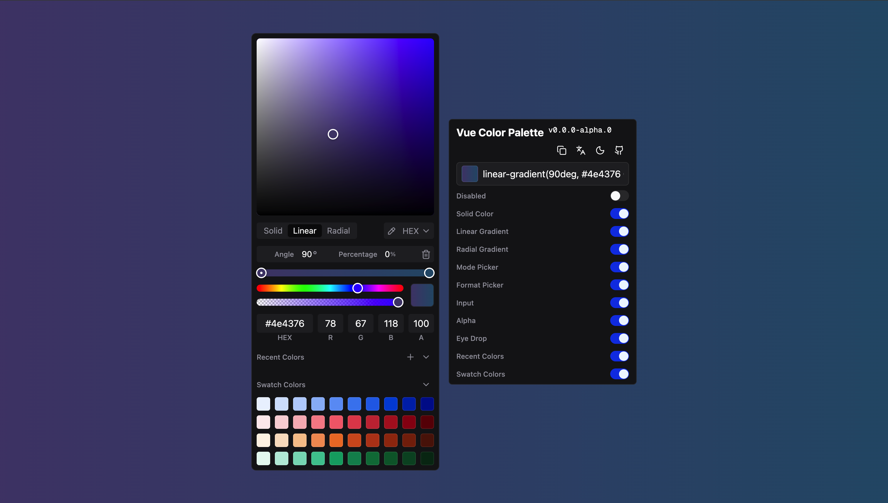

# vue-color-palette

[![npm version][npm-version-src]][npm-version-href]
[![License][license-src]][license-href]

```sh
pnpm add vue-color-palette
```

<p align='center'>

</p>

<p align="center">
<a href="https://vue-color-palette.netlify.app/">Playground</a>
</p>

## Usage

### Styles

You need to import the component styles:

```ts
import 'vue-color-palette/index.css'
```

> [!IMPORTANT]
> 🚧 Only import `theme.css` if you are **NOT** using shadcn-schema in your project:

```ts
import 'vue-color-palette/theme.css'
```

### Basic Usage

`ColorPicker` renders the panel directly. Use `ColorPickerTrigger` if you need a trigger button:

```vue
<script setup lang="ts">
import { ref } from 'vue'
import { ColorPicker, ColorPickerTrigger } from 'vue-color-palette'
import 'vue-color-palette/index.css'

const color = ref('#1447e6')
</script>

<template>
  <!-- Direct panel -->
  <ColorPicker v-model:value="color" />

  <!-- With trigger button -->
  <ColorPickerTrigger v-model:value="color" />
</template>
```

### Props

#### ColorPickerProps

- `value` - Current color value (supports solid colors and gradients)
- `defaultValue` - Default color value
- `colorModes` - Available color modes: `'monochrome' | 'linear-gradient' | 'radial-gradient'`
- `format` - Color format: `'HEX' | 'RGB' | 'HSL' | 'HSV' | 'CMYK'`
- `disabled` - Whether the picker is disabled
- `enableModePicker` - Enable mode picker (solid/gradient)
- `enableFormatPicker` - Enable format picker
- `enableInput` - Enable color input fields
- `enableAlpha` - Enable alpha channel control
- `enableEyeDrop` - Enable eye dropper tool
- `recentColors` - Recent colors array or `false` to disable
- `swatchColors` - Swatch colors array or `true` to use default colors
- `locale` - Locale string or custom locale config
- `isDark` - Force dark mode (undefined for auto detection)

#### ColorPickerTriggerProps

Extends `ColorPickerProps` with:

- `placeholder` - Placeholder text for the trigger button

## Credits

- [react-best-gradient-color-picker](https://github.com/hxf31891/react-gradient-color-picker) - UI design is largely inspired by this project
- [TDesign](https://tdesign.tencent.com/vue-next/components/color-picker-en?tab=demo) - Built-in color presets are based on TDesign
- [vue3-color-picker](https://github.com/cyhnkckali/vue3-color-picker)

## License

[MIT](./LICENSE) License © [jinghaihan](https://github.com/jinghaihan)

<!-- Badges -->

[npm-version-src]: https://img.shields.io/npm/v/vue-color-palette?style=flat&colorA=080f12&colorB=1fa669
[npm-version-href]: https://npmjs.com/package/vue-color-palette
[npm-downloads-src]: https://img.shields.io/npm/dm/vue-color-palette?style=flat&colorA=080f12&colorB=1fa669
[npm-downloads-href]: https://npmjs.com/package/vue-color-palette
[bundle-src]: https://img.shields.io/bundlephobia/minzip/vue-color-palette?style=flat&colorA=080f12&colorB=1fa669&label=minzip
[bundle-href]: https://bundlephobia.com/result?p=vue-color-palette
[license-src]: https://img.shields.io/badge/license-MIT-blue.svg?style=flat&colorA=080f12&colorB=1fa669
[license-href]: https://github.com/jinghaihan/vue-color-palette/LICENSE
[jsdocs-src]: https://img.shields.io/badge/jsdocs-reference-080f12?style=flat&colorA=080f12&colorB=1fa669
[jsdocs-href]: https://www.jsdocs.io/package/vue-color-palette
